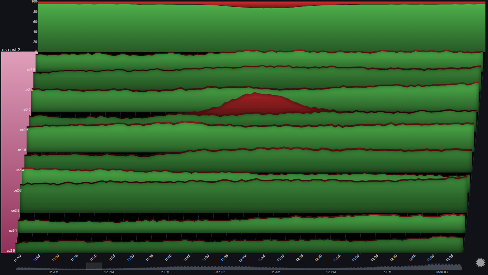
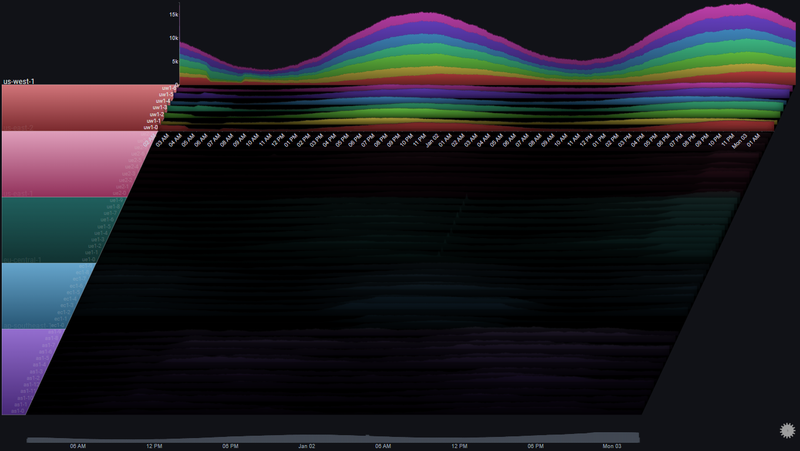
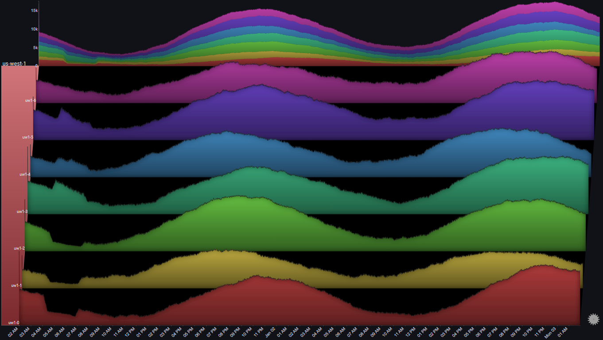
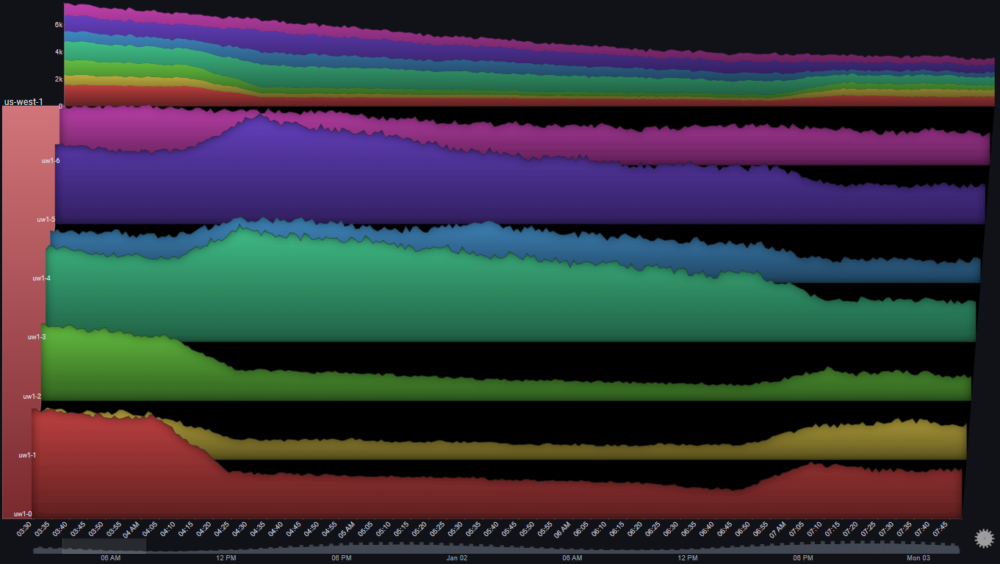

# Examples

## I.  Requests to Servers
The following example showcases how a Sierra Plot can be used to visualize and analyze a scenario of requests hitting:

<ul>
<li>50 different servers</li>
<li>in 5 different regions</li>
<li>over 48 hours</li>
<li>in 1-minute bins</li>
<li>split by result type (<i>OK</i> or <i>ERROR</i>)
</ul>

Before diving in, we can make the plot a bit clearer by changing the plot's [`Max Y Type`](configuration_options.md#series) from `Global` to `Group` using the [on-panel controls](controls.md)
!!! hint inline

    Using `Max Y Type` => `Group` makes sense here, since comparing individual server metrics across different regions isn't very relevant.  The overall comparison across different regions is captured in the Totals chart

### I.I  Overview

#### I.I.I  Overall Trend

The Totals chart is a simple stacked area chart that clearly shows the overall trend, as well as the per-region breakdown.  However, it doesn't do a very good job of showing the indiviual trends for each region.
 
By changing the [`Totals Chart Type`](configuration_options.md#totals) to `Line` and playing aroung with the `Total Height Percent` value, we get:

A number of observations become apparent now:
<ol>
<li>The trend shows a (baseline) 24 hour cycle in every region</li>
<li>A certain time shift between the 24 hour cycles for each region (except <i>us-east-1</i> and <i>us-east-2</i>)</li>
<li>A huge spike in <i>us-east-1</i> near the middle of the chart</li>
<li>An unusual increase in request volume in <i>us-east-1</i> near the end of the chart</li>
<li>An unusual increase in request volume in <i>us-east-2</i> near the end of the chart.  Around the same time as in  <i>us-east-1</i>, but much steeper</li>
</ol>

#### I.I.II  Error Trend

We can see the request count by type (<i>OK</i> or <i>ERROR</i>) by using the [`Series Breakdown`](configuration_options.md#series) and [`Totals Breakdown`](configuration_options.md#totals) features in the plot's [controls](controls.md):

!!! note inline

    Using [`Stacked100`](features.md#totals-drilldown) for the totals chart, since we usually care more about the relative error rate, and not the absoulte number of errors

We immediately see that the overall error rate is pretty much constant (at 5%) except for two increases, one starting at around 10:00 AM Jan 01, and the second a few hours later
 
It's also straightforward to attribute the first (bigger) increase to the servers in ap-southeast-1, and the second (smaller) increase to a single server in us-east-2
 
 
Before drilling down into the specific issues, let's take one more step just to make sure that we didn't miss anything in our high-level view
 
To get a clear picture that specifically targets error rates (as opposed to the volume of requests and their breakdowns) we'll make the following adjustments to the plot's configuration:
<ol>
<li>Change the <a href="/configuration_options/#series">Series Chart Type</a> and <a href="/configuration_options/#totals">Totals Chart Type</a> from <i>Stacked Area Chart</i> to <i>Line Chart</i></li>
<li>Set the <b>Total</b> field as the plot's <a href="/configuration_options/#fields-advanced">Weight Field</a></li>
<li>Set the field value <i>ERROR</i> as the only <a href="/configuration_options/#fields-advanced">Series Value</a></li>
<li>Change the value of <a href="/configuration_options/#series">Aggregation</a> from <i>Sum</i> to <i>Average</i></li>
<li>Set the <a href="/configuration_options/#style">Color Mode</a> to <i>Values (Inverted)</i></li>
</ol>
!!! note inline

    Instead of the number of requests of each type, the plot now represents the relative error rate `Error / Total` for each server.  The Totals chart represents the weighted error rate across its selected breakdown

We can now feel confident that we didn't miss anything before (for example, a high error rate during a time where the number of requests is very small, which might not be visible in a stacked area chart)

### I.II  Specific Drilldowns
Now that we have a high-level picture of the systems behaviour over the 48 hour period, we'll drilldown into the specific issues that were spotted and see what kinds of information the plot might surface up

#### I.II.I  Error Spike in us-east-2
In [I.I.II](examples.md#iiii-error-trend) we saw an error spike in us-east-2 at around 12:00 PM on Jan 01
 
By [drilling down on the us-east-2 group](features.md#group-drilldown) and focusing on the specific time around the issue using the [date range control](features.md#date-range-control) we can get a clearer picture of the behavior in us-east-2 at the time of the issue:

!!! note inline

    In this example, [`Gridlines`](controls.md) were enabled.  They help us connect events in the plot to specific points in time (which might be difficult due to the plot's skew property)

We'll drilldown on us-east-2 again so we can focus on it completely:

A number of observations become apparent now:
<ol>
<li>The issue only happened in one server (<i>ue2-6</i>)</li>
<li>The effect on the region's overall error rate was an increase from around 5% to around 10%</li>
<li>The number of requests for all other servers was pretty much constant at the time of the issue</li>
<li>For the affected server (<i>ue2-6</i>), the number of non-error requests  was pretty much constant around the time of the issue</li>
</ol>
The above observations might lead us to the following conclusions:
<ol>
<li>All servers were functioning as expected</li>
<li>The errors in <i>ue2-6</i> are due to a specific batch of requests that speficially resulted in errors</li>
<li>The abnormal requests to <i>ue2-6</i> did not affect its serving of <i>normal</i> requests</li>
</ol>

#### I.II.II  Error Spike in ap-southeast-1

In [I.I.II](examples.md#iiii-error-trend) we saw an error spike in ap-southeast-1 at around 10:00 AM on Jan 01
 
By [drilling down on the ap-southeast-1 group](features.md#group-drilldown) we can get a clearer picture of the behaviour of the servers in that region:

A number of observations become apparent now:
<ol>
<li>All servers in that region were affected in roughly the same way</li>
<li>At the peak of the issue, 100% of requests resulted in errors</li>
<li>The trend in overall number of requests to the servers in ap-southeast-1 was not affected by the issue</li>
</ol>

The above observations might lead us to the following conclusions:
<ol>
<li>The issue (errors) was due to something internal (not due to some change in the requests)</li>
<li>Since the issue affected all of the servers in the region, and at the same time, there's a good chance that the issue is due to some shared infrastructure component in the region</li>
</ol>

#### I.II.III  Traffic Routing

If we look at us-west-1, we can spot something odd happening at around 06:00 AM Jan 01:

Let's drilldown further:

And now let's focus on the specific time range:
 

A number of observations become apparent now:
<ol>
<li>The number of requests to 3 servers (<i>uw1-0</i>, <i>uw1-1</i> & <i>uw1-2</i>) <b>dropped</b> between 04:00 AM and 07:00 AM</li>
<li>The number of requests to 3 servers (<i>uw1-3</i>, <i>uw1-4</i> & <i>uw1-5</i>) <b>increased</b> at the same time</li>
<li>The trend in total number of requests to the region did not change during that time period</li>
<li>While the traffic to <i>uw1-0</i>, <i>uw1-1</i> & <i>uw1-2</i> decreased, it did not go to zero</li>
<li>There was no change in the traffic to usw1-6</li>
</ol>

The above observations might lead us to the following conclusions:
<ol>
<li>Some traffic routing/balancing mechanism shifted <b>some</b> of the traffic from [<i>uw1-0</i>, <i>uw1-1</i> & <i>uw1-2</i>] to [<i>uw1-3</i>, <i>uw1-4</i> & <i>uw1-5</i>]</li>
<li>It doesn't seem like there was some clear issue in the first three servers, since they were still getting traffic and there wasn't an increase in errors</li>
</ol>

## II. Foo