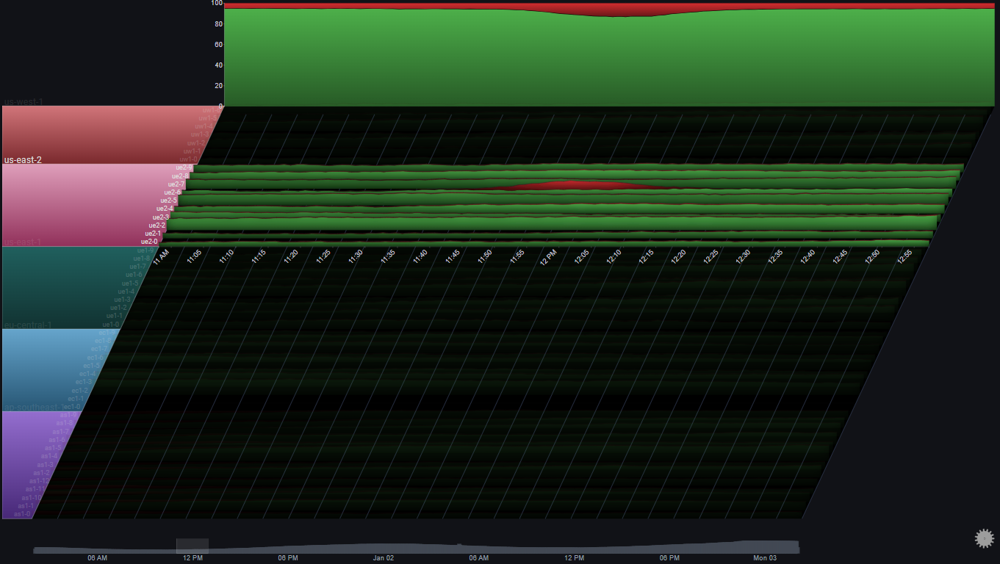
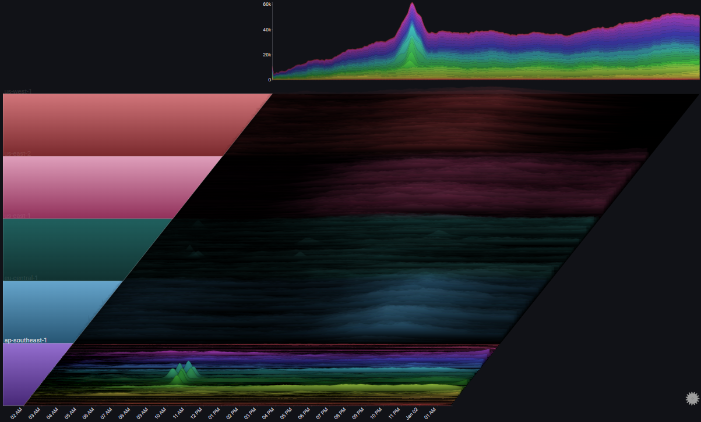

# Examples

## I.  Requests to Servers
The following example showcases how a Sierra Plot can be used to visualize and analyze a scenario of requests hitting:

<ul>
<li>50 different servers</li>
<li>in 5 different regions</li>
<li>over 48 hours</li>
<li>in 1-minute bins</li>
<li>split by result type (<i>OK</i> or <i>ERROR</i>)
</ul>

Before diving in, we can make the plot a bit clearer by changing the plot's [`Max Y Type`](configuration_options.md#series) from `Global` to `Group` using the [on-panel controls](controls.md)
!!! hint inline

    Using `Max Y Type` => `Group` makes sense here, since comparing individual server metrics across different regions isn't very relevant.  The overall comparison across different regions is captured in the Totals chart

### I.I  Overview

#### I.I.I  Overall Trend

The Totals chart is a simple stacked area chart that clearly shows the overall trend, as well as the per-region breakdown.  However, it doesn't do a very good job of showing the indiviual trends for each region.
 
By changing the [`Totals Chart Type`](configuration_options.md#totals) to `Line` and playing aroung with the `Total Height Percent` value, we get:

A number of observations become apparent now:
<ol>
<li>The trend shows a (baseline) 24 hour cycle in every region</li>
<li>A certain time shift between the 24 hour cycles for each region (except <i>us-east-1</i> and <i>us-east-2</i>)</li>
<li>A huge spike in <i>us-east-1</i> near the middle of the chart</li>
<li>An unusual increase in request volume in <i>us-east-1</i> near the end of the chart</li>
<li>An unusual increase in request volume in <i>us-east-2</i> near the end of the chart.  Around the same time as in  <i>us-east-1</i>, but much steeper</li>
<li>In <i>eu-central-1</i> there were two servers which didn't get any traffic at all during most of the 48 hour period</li>
</ol>

#### I.I.II  Error Trend

We can see the request count by type (<i>OK</i> or <i>ERROR</i>) by using the [`Series Breakdown`](configuration_options.md#series) and [`Totals Breakdown`](configuration_options.md#totals) features in the plot's [controls](controls.md):

!!! note inline

    Using [`Stacked100`](features.md#totals-drilldown) for the totals chart, since we usually care more about the relative error rate, and not the absoulte number of errors

We immediately see that the overall error rate is pretty much constant (at 5%) except for two increases, one starting at around 10:00 AM Jan 01, and the second a few hours later
 
It's also straightforward to attribute the first (bigger) increase to the servers in ap-southeast-1, and the second (smaller) increase to a single server in us-east-2
 
 
Before drilling down into the specific issues, let's take one more step just to make sure that we didn't miss anything in our high-level view
 
To get a clear picture that specifically targets error rates (as opposed to the volume of requests and their breakdowns) we'll make the following adjustments to the plot's configuration:
<ol>
<li>Change the <a href="configuration_options/#series">Series Chart Type</a> and <a href="configuration_options/#totals">Totals Chart Type</a> from <i>Stacked Area Chart</i> to <i>Line Chart</i></li>
<li>Set the <b>Total</b> field as the plot's <a href="configuration_options/#fields-advanced">Weight Field</a></li>
<li>Set the field value <i>ERROR</i> as the only <a href="configuration_options/#fields-advanced">Series Value</a></li>
<li>Change the value of <a href="configuration_options/#series">Aggregation</a> from <i>Sum</i> to <i>Average</i></li>
<li>Set the <a href="configuration_options/#style">Color Mode</a> to <i>Values (Inverted)</i></li>
</ol>
!!! note inline

    Instead of the number of requests of each type, the plot now represents the relative error rate `Error / Total` for each server.  The Totals chart represents the weighted error rate across its selected breakdown

We can now feel confident that we didn't miss anything before (for example, a high error rate during a time where the number of requests is very small, which might not be visible in a stacked area chart)

### I.II  Specific Drilldowns
Now that we have a high-level picture of the systems behaviour over the 48 hour period, we'll drilldown into the specific issues that were spotted and see what kinds of information the plot might surface up

#### I.II.I  Error Spike in us-east-2
In [I.I.II](examples.md#iiii-error-trend) we saw an error spike in us-east-2 at around 12:00 PM on Jan 01
 
By [drilling down on the us-east-2 group](features.md#group-drilldown) and focusing on the specific time around the issue using the [date range control](features.md#date-range-control) we can get a clearer picture of the behavior in us-east-2 at the time of the issue:

!!! note inline

    In this example, [`Gridlines`](controls.md) were enabled.  They help us connect events in the plot to specific points in time (which might be difficult due to the plot's skew property)

We'll drilldown on us-east-2 again so we can focus on it completely:

A number of observations become apparent now:
<ol>
<li>The issue only happened in one server (<i>ue2-6</i>)</li>
<li>The effect on the region's overall error rate was an increase from around 5% to around 10%</li>
<li>The number of requests for all other servers was pretty much constant at the time of the issue</li>
<li>For the affected server (<i>ue2-6</i>), the number of non-error requests  was pretty much constant around the time of the issue</li>
</ol>
The above observations might lead us to the following conclusions:
<ol>
<li>All servers were functioning as expected</li>
<li>The errors in <i>ue2-6</i> are due to a specific batch of requests that speficially resulted in errors</li>
<li>The abnormal requests to <i>ue2-6</i> did not affect its serving of <i>normal</i> requests</li>
</ol>

#### I.II.II  Error Spike in ap-southeast-1

In [I.I.II](examples.md#iiii-error-trend) we saw an error spike in ap-southeast-1 at around 10:00 AM on Jan 01
 
By [drilling down on the ap-southeast-1 group](features.md#group-drilldown) we can get a clearer picture of the behaviour of the servers in that region:

A number of observations become apparent now:
<ol>
<li>All servers in that region were affected in roughly the same way</li>
<li>At the peak of the issue, 100% of requests resulted in errors</li>
<li>The trend in overall number of requests to the servers in ap-southeast-1 was not affected by the issue</li>
</ol>

The above observations might lead us to the following conclusions:
<ol>
<li>The issue (errors) was due to something internal (not due to some change in the requests)</li>
<li>Since the issue affected all of the servers in the region, and at the same time, there's a good chance that the issue is due to some shared infrastructure component in the region</li>
</ol>

#### I.II.III  Traffic Routing

If we look at us-west-1, we can spot something odd happening at around 06:00 AM Jan 01:

Let's drilldown further:

And now let's focus on the specific time range:
 

A number of observations become apparent now:
<ol>
<li>The number of requests to 3 servers (<i>uw1-0</i>, <i>uw1-1</i> & <i>uw1-2</i>) <b>dropped</b> between 04:00 AM and 07:00 AM</li>
<li>The number of requests to 3 servers (<i>uw1-3</i>, <i>uw1-4</i> & <i>uw1-5</i>) <b>increased</b> at the same time</li>
<li>The trend in total number of requests to the region did not change during that time period</li>
<li>While the traffic to <i>uw1-0</i>, <i>uw1-1</i> & <i>uw1-2</i> decreased, it did not go to zero</li>
<li>There was no change in the traffic to usw1-6</li>
</ol>

The above observations might lead us to the following conclusions:
<ol>
<li>Some traffic routing/balancing mechanism shifted <b>some</b> of the traffic from [<i>uw1-0</i>, <i>uw1-1</i> & <i>uw1-2</i>] to [<i>uw1-3</i>, <i>uw1-4</i> & <i>uw1-5</i>]</li>
<li>It doesn't seem like there was some clear issue in the first three servers, since they were still getting traffic and there wasn't an increase in errors</li>
</ol>

#### I.II.IV  Auto Scaling

We noticed earlier that in <i>eu-central-1</i>, two servers didn't get any traffic at all during most of the 48 hour period
 
Let's focus on that region:

A number of observations become apparent now:
<ol>
<li>Two server (<i>ec1-0</i> & <i>ec1-1</i>) didn't get any requests at all, until Jan 01 at 10:00 PM</li>
<li>At about the same time, two other servers (<i>ec1-2</i> & <i>ec1-3</i>) started seeing an increase in the number of requests</li>
<li>At around 01:00 AM Jan 02, the number of requests to <i>ec1-2</i> & <i>ec1-3</i> seems to have plateaued</li>
<li>At about the same time, the number of requests to <i>ec1-0</i> & <i>ec1-1</i> seems to have increased sharply</li>
<li>After the load on <i>ec1-2</i> & <i>ec1-3</i> subsided, traffic was shifted away from <i>ec1-0</i> & <i>ec1-1</i> until they were pulled out of rotation completely</i>
</ol>

The above observations might lead us to the following conclusions:
<ol>
<li>When the load on <i>ec1-2</i> & <i>ec1-3</i> increased (and passed some threshold), some autoscaling mechanism was triggered</li>
<li>The autoscaling mechanism added <i>ec1-0</i> & <i>ec1-1</i> into rotation and they started getting traffic</li>
<li>At some point, <i>ec1-2</i> & <i>ec1-3</i> reached some capacity threshold, and the LB mechanism maintained that threshold</li>
<li>Since <i>ec1-2</i> & <i>ec1-3</i> were saturated, the LB mechanism started offloading more traffic to  <i>ec1-0</i> & <i>ec1-1</i></li>
<li>The asymmetry between the ramp up (fast) and ramp down (slow) of traffic to <i>ec1-0</i> & <i>ec1-1</i> might indicate some hysteresis element at play</li>
</ol>

Let's see if there was any noticeable effect on the amount of errors during that time:

A number of observations become apparent now:
<ol>
<li>During the sharp increase in the number of requests to <i>ec1-2</i> & <i>ec1-3</i>, the error rate in those two servers slightly increased (also noticeable in the total graph for the region)</li>
<li>Once <i>ec1-0</i> & <i>ec1-1</i> were added to the rotation the error rates subsided</li>
</ol>

The above observations might lead us to the following conclusions:
<ol>
<li>Overall, the LB mechanism is functioning properly</li>
<li>Ideally, the additional servers could be added sooner and prevent the temporary increase in errors</li>
<li>There's some optimization opportunities to the LB.  Specfically, it looks like the scale down could be much more aggresive</li>
</ol>

#### I.II.V  Region Spillover

Let's focus on the regions us-east-1 and us-east-2 by selecting them as the `Group Values` in [Fields [Advanced]](configuration_options.md#fields-advanced):

By looking at the Totals chart we can observe the following:
<ol>
<li>At around 20:00 Jan 02, us-east-1 saw a <b>gradual</b> increase in request volume</li>
<li>About an hour later, us-east-2 saw a <b>sharp</b> increase in request volume</li>
</ol>

By looking at the series charts we can observe the following:
<ol>
<li>At around 21:00 Jan 02, the request volume to us-east-1 started plateauing</li>
</ol>

The above observations might lead us to the following conclusions:
<ol>
<li>The servers in us-east-1 reached some capacity threshold at 21:00</li>
<li>At that point, traffic started to spill over to us-east-2</li>
</ol>

It might be interesting to change the Totals chart's stack mode to `Stacked100`, to see the relative traffic distribution between the two us-east regions:

This shows us that the traffic distribution between the two us-east regions is roughly equal.
 
One of the regions (us-east-1) started getting a bigger relative share of the traffic, but it was re-balanced after an hour or so

## II. Mortality Rates

The following example shows the mortality rates in France between 1816 and 2016, by gender
 
It is based on the amazing [visualization](https://kieranhealy.org/blog/archives/2018/12/04/heatmaps-of-mortality-rates/) created by [Kieran Healy](https://kieranhealy.org/):

!!! note inline

    The [chart labels](configuration_options.md#labels) have been disabled for clarity.  Each chart represents a single age cohort, starting from <i>0-1</i> at the bottom to <i>95</i> at the top

The plot allows us to immediatly observe events such as world wars and the 1918 influenza pandemic, as well as the considerable decline in infant mortality

By switching the [`max Y type`](configuration_options.md#series) to `Local` we get a different representation, which makes it easier to see trends for each individual age cohort (at the cost of losing the ability to compare values across different age cohorts):

We can also decide to group certain ages, and represent that in the plot:

By switching the [`max Y type`](configuration_options.md#series) to `Group` we can see trends for each age cohort relative to its defined group:

Some more styling options:

## III. Covid19 Cases

The following example shows the number of daily reported Covid-19 cases in the United States, by state:

By switching the [`max Y type`](configuration_options.md#series) to `Local` we get a different representation which shows us the trend in each specific state (each chart's Y-axis has its own scale):

By enabling [`Fog`](features.md#fog) we can highlight the peaks in the plot.  Since we're using `Local` for [`max Y type`](configuration_options.md#series), the [`Fog`](features.md#fog) shows us the alignment of the peaks across all charts (basically, the peaks of the Covid-19 infection waves):

Some more styling options:

## III. Lots of Charts

The following examples showcases how Sierra Plots are useful for visualizing high-cardinality datasets

### III.I 200 Servers

The following example shows request rates across a 24 hour period (with 5 minute bins) for <b>200</b> servers across 5 different regions
 
It shows that even with a very large number of charts, overall trends and abnormal behaviours are still easy to spot:

### III.II 2000 Servers

Let's get a little crazy...
 
The following example shows request rates across a 12 hour period (with 5 minute bins) for <b>2000</b> servers across 5 different regions
 
Even now, trends and outliers are still readily apparent

