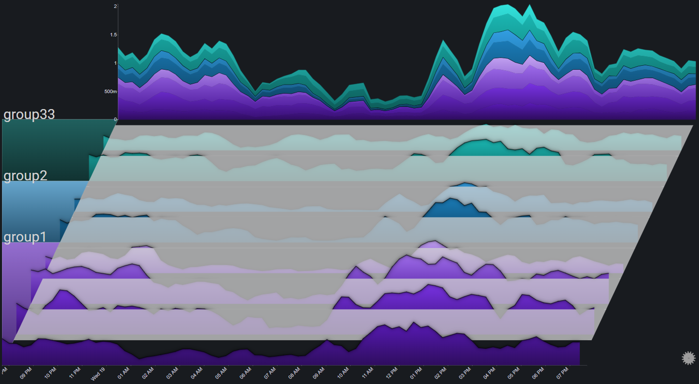

# Features

## Drilldowns

### Group Drilldown
It is possible to drilldown into a specific group by clicking the (colored) group segment on the left part of the plot
 

 
 
The first drilldown focuses on the group by changing the plot's appearance in the following ways:
<ol>
<li>
Fading out all of the other groups
</li>
<li>
Changing the color palette for the charts in the selected group (to make them more distinct)
</li>
<li>
Having the totals chart represent only the data from the selected group
</li>
</ol>

 
 
Drilling down into a group that's already in focus, changes it to exlucsive mode, where in addition to the effects of focusing the group, all of the other groups are altogether removed from the plot
 

 
Clicking on a group that is already in exclusive mode will reset the selection (no group is selected)

### Chart Drilldown

Clicking on a chart brings it into focus by changing the plot's appearance in the following ways:
<ol>
<li>
Fading out all of the charts
</li>
<li>
Setting the X-axis right below the selected chart
</li>
</ol>

 
Clicking on a chart that is already in focus will reset the selection (no chart is selected)

### Totals Drilldown

Clicking on the totals chart switches its stack mode from regular to stacked to 100% and back
 

## Date Range Control

The date range control allows for zooming in to specific areas of the plot
 
It is especially useful for data sets that have a high number of time points.
 
 
The date range control can be enabled via the [plot controls](controls.md).  It will appear as a simple column chart (representing the plot's total) at the bottom of the plot

A specific time range can be selected by clicking on the date range control chart and dragging across a range:

The selection can be modified and moved by interacting with it.  A single click on the date range control chart (outside of the selection) will reset the selected range:

## Fog

Fog is used to highlight values above a certain threshold.  Parts of the chart below the fog's height will be hidden under the fog
 
By using fog, it is much easier to spot outlier values (which will be above the fog)

## Transitions

Tranistions are used to create sort of dynamic slideshows from Sierra plots.
 
The most common use case would be a dashboard that is presented over a long period of time and with no user interaction (such as on a TV monitor), where there's value in periodically cycling between which plot elements are in focus.
 
 
There are two different tranisition modes:
 
 
1. `Group`: The plot periodically highlights a different group:
 

 
2. `Chart`: The plot periodically highlights a different chart:
 

The cycle period is [configurable](configuration_options.md#transitions)