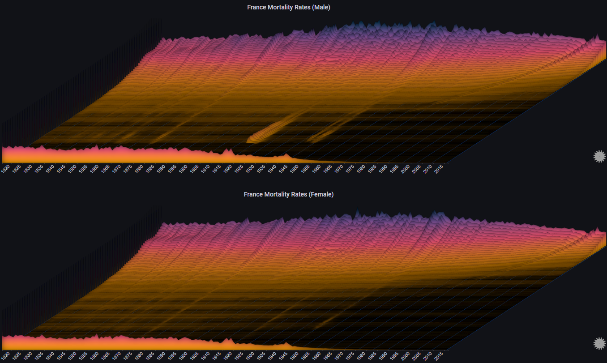

# Getting Started

## Plugin Test Environment

The simplest way to play around with Sierra Plot is to use the docker-compose [plugin test environment](https://github.com/boazreicher/sierra-plot/tree/main/plugin-test-environment)

Docker compose will run a container with a Grafana instance (pn port 3000) that has the Sierra Plot plugin installed, along with a number of sample dashboards

## Examples

The following examples can be used to get a better practical sense of how Sierra Plots work
 
Each example contains the source data (in <i>csv</i> format) and a sample dashboard JSON file
 
To load the data into Grafana, the [CSV Datasource plugin](https://grafana.com/grafana/plugins/marcusolsson-csv-datasource/) is required
 
When using the CSV Datasource, the [prepare time series transformation](https://grafana.com/docs/grafana/latest/panels/transformations/types-options/#prepare-time-series) needs to be used (already configured in the sample dashboard JSONs)

!!! note inline

    The data used in the following examples should not be used for any actual analysis.  Some of the data is completely generated, while some is based on real-world data sets, but with modifications made just for the purpose of these examples

### Servers

Based on [this example](examples.md#i-requests-to-servers)
 
Dataset: [CSV](https://github.com/boazreicher/sierra-plot/raw/main/examples/data/test_servers.csv)
 
Dashboard: [JSON](https://github.com/boazreicher/sierra-plot/raw/main/examples/dashboards/server1.json)

### Servers Errors

Based on [this example](examples.md#iiii-error-trend)
 
Dataset: [CSV](https://github.com/boazreicher/sierra-plot/raw/main/examples/data/test_servers.csv)
 
Dashboard: [JSON](https://github.com/boazreicher/sierra-plot/raw/main/examples/dashboards/servers_errors.json)

### Mortality Rates

Based on [this example](examples.md#ii-mortality-rates)
 
Dataset: [CSV](https://github.com/boazreicher/sierra-plot/raw/main/examples/data/france_mortality.csv)
 
Dashboard: [JSON](https://github.com/boazreicher/sierra-plot/raw/main/examples/dashboards/mortality.json)

### Covid-19

Based on [this example](examples.md#iii-covid19-cases)
 
Dataset: [CSV](https://github.com/boazreicher/sierra-plot/raw/main/examples/data/us_states_increases_with_gender.csv)
 
Dashboard: [JSON](https://github.com/boazreicher/sierra-plot/raw/main/examples/dashboards/covid19.json)

### Promethues Datasource
The following example uses the standard Prometheus data source and uses the metric for the CPU utilization of the Prometheus server
 
Dashboard: [JSON](https://github.com/boazreicher/sierra-plot/raw/main/examples/dashboards/prometheus.json)

### TestData DB Datasource
The following example uses the default TestData DB data source
 
Dashboard: [JSON](https://github.com/boazreicher/sierra-plot/raw/main/examples/dashboards/randomwalk.json)

