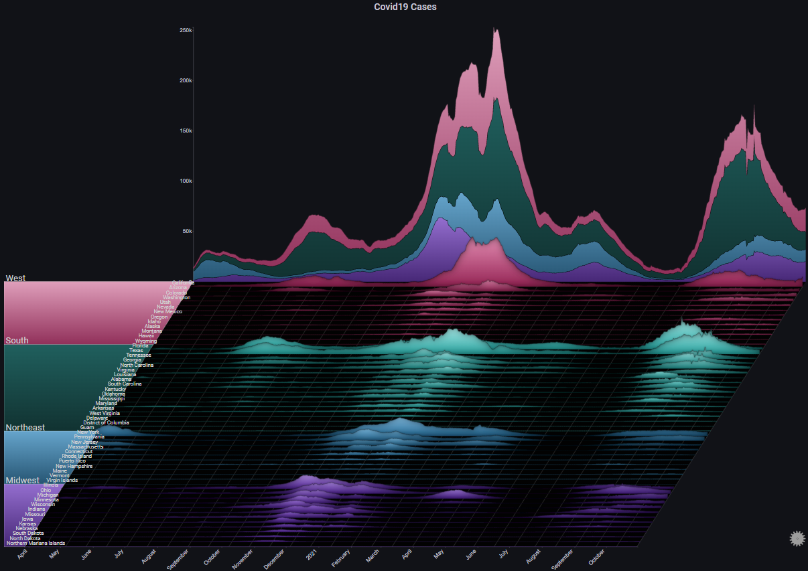

# Getting Started

The following examples can be used to get a better practical sense of how Sierra Plots work
 
Each example contains the source data (in <i>csv</i> format) and a sample dashboard JSON file
 
To load the data into Grafana, the [CSV Datasource plugin](https://grafana.com/grafana/plugins/marcusolsson-csv-datasource/) is required

!!! note inline

    The data used in the following examples should not be used for any actual analysis.  Some of the data is completely generated, while some is based on real-world data sets, but with modifications made just for the purpose of these examples

## Covid-19

Based on [this example](examples.md#iii-covid19-cases)
 
Dataset: [CSV](https://github.com/boazreicher/sierra-plot/raw/main/examples/data/us_states_increases_with_gender.csv)
 
Dashboard: [JSON](https://github.com/boazreicher/sierra-plot/raw/main/examples/dashboards/covid19.json)

